# OpenImjang 시스템 아키텍처 및 기능 스키마

> AI 기반 부동산 종합 분석 및 공간정보 시각화 플랫폼의 전체 시스템 구조와 기능 흐름

## 📋 목차
1. [유즈케이스 다이어그램](#1-유즈케이스-다이어그램)
2. [시스템 컴포넌트 구조](#2-시스템-컴포넌트-구조)
3. [주요 기능별 시퀀스 다이어그램](#3-주요-기능별-시퀀스-다이어그램)
4. [데이터 플로우 다이어그램](#4-데이터-플로우-다이어그램)
5. [데이터베이스 ER 다이어그램](#5-데이터베이스-er-다이어그램)

---

## 1. 유즈케이스 다이어그램

### 전체 시스템 유즈케이스

```mermaid
graph TD
    %% 액터 정의
    Guest[👤 비로그인 사용자]
    User[🔐 로그인 사용자]
    System[🤖 시스템]
    
    %% 비로그인 사용자 기능
    Guest --> UC1[부동산 검색]
    Guest --> UC2[지도 탐색]
    Guest --> UC3[실거래가 조회]
    Guest --> UC4[건물 정보 조회]
    Guest --> UC5[주변 시설 조회]
    Guest --> UC6[구글 로그인]
    
    %% 로그인 사용자 추가 기능
    User --> UC1
    User --> UC2
    User --> UC3
    User --> UC4
    User --> UC5
    User --> UC7[온보딩 설정]
    User --> UC8[AI 종합 분석]
    User --> UC9[AI 챗봇 대화]
    User --> UC10[임장 메모 작성]
    User --> UC11[즐겨찾기 관리]
    User --> UC12[내 임장 목록]
    User --> UC13[사용자 프로필 관리]
    
    %% 시스템 자동 기능
    System --> UC14[실시간 데이터 수집]
    System --> UC15[공간 데이터 분석]
    System --> UC16[AI 응답 생성]
    
    %% 서브 유즈케이스
    UC1 --> UC1_1[이름으로 검색]
    UC1 --> UC1_2[주소로 검색]
    UC1 --> UC1_3[좌표 기반 검색]
    
    UC2 --> UC2_1[2D 지도 보기]
    UC2 --> UC2_2[3D 지도 보기]
    UC2 --> UC2_3[지적편집도 오버레이]
    UC2 --> UC2_4[위성/일반 지도 전환]
    
    UC10 --> UC10_1[메모 작성]
    UC10 --> UC10_2[사진 첨부]
    UC10 --> UC10_3[메모 수정]
    UC10 --> UC10_4[메모 삭제]
    
    UC11 --> UC11_1[즐겨찾기 추가]
    UC11 --> UC11_2[즐겨찾기 제거]
    UC11 --> UC11_3[즐겨찾기 핀 토글]
```

---

## 2. 시스템 컴포넌트 구조

### 2.1 프론트엔드 컴포넌트 아키텍처

```mermaid
graph TB
    %% 메인 앱
    App[App.tsx<br/>📱 메인 애플리케이션]
    Router[Router.tsx<br/>🛣️ 라우팅 관리]
    AuthProvider[AuthProvider.tsx<br/>🔐 인증 컨텍스트]
    
    %% 페이지 레벨
    Home[Home.tsx<br/>🏠 메인 페이지]
    
    %% 레이아웃 컴포넌트
    TopBar[TopBar.tsx<br/>📊 상단 바]
    
    %% 지도 관련 컴포넌트
    MapContainer[MapContainer.tsx<br/>🗺️ 2D 카카오맵]
    MapControls[MapControls.tsx<br/>🎮 지도 컨트롤]
    Map3DViewer[MapPrime3DViewer.tsx<br/>🌍 3D Cesium 뷰어]
    GeoOverlay[GeoPolygonOverlay.tsx<br/>📐 지적편집도 오버레이]
    LayerToggle[LayerToggle.tsx<br/>🔄 레이어 토글]
    
    %% 카드/정보 컴포넌트
    SummaryCard[SummaryCard.tsx<br/>📋 요약 카드]
    DealsTable[RealEstateDealsTable.tsx<br/>💰 실거래가 테이블]
    BuildingInfo[BuildingLandInfo.tsx<br/>🏢 건물 정보]
    NearbyPanel[NearbyInfoPanel.tsx<br/>📍 주변 정보]
    AiSummaryPanel[AiSummaryPanel.tsx<br/>🤖 AI 요약 패널]
    
    %% AI 관련 컴포넌트
    AIAnalysis[AIAnalysisModal.tsx<br/>🔬 AI 분석 모달]
    AIChatbot[AIChatbot.tsx<br/>💬 AI 챗봇]
    ChatbotModal[ChatbotModal.tsx<br/>💭 챗봇 모달]
    
    %% 사용자 관리 컴포넌트
    AuthPage[AuthPage.tsx<br/>🔑 로그인 페이지]
    Onboarding[UserOnboardingModal.tsx<br/>👋 온보딩 모달]
    UserProfile[UserProfileModal.tsx<br/>👤 사용자 프로필]
    
    %% 메모/즐겨찾기 컴포넌트
    MemoCreate[MemoCreateModal.tsx<br/>✍️ 메모 작성]
    MyImjang[MyImjangModal.tsx<br/>📝 내 임장 목록]
    FavoritePopup[FavoriteConfirmPopup.tsx<br/>⭐ 즐겨찾기 확인]
    
    %% 관계 설정
    App --> Router
    App --> AuthProvider
    Router --> Home
    
    Home --> TopBar
    Home --> MapContainer
    Home --> MapControls
    Home --> Map3DViewer
    Home --> SummaryCard
    Home --> AuthPage
    Home --> Onboarding
    Home --> UserProfile
    Home --> AIAnalysis
    Home --> AIChatbot
    Home --> ChatbotModal
    Home --> MemoCreate
    Home --> MyImjang
    Home --> FavoritePopup
    
    MapContainer --> GeoOverlay
    MapContainer --> LayerToggle
    
    SummaryCard --> DealsTable
    SummaryCard --> BuildingInfo
    SummaryCard --> NearbyPanel
    SummaryCard --> AiSummaryPanel
```

### 2.2 백엔드 API 구조

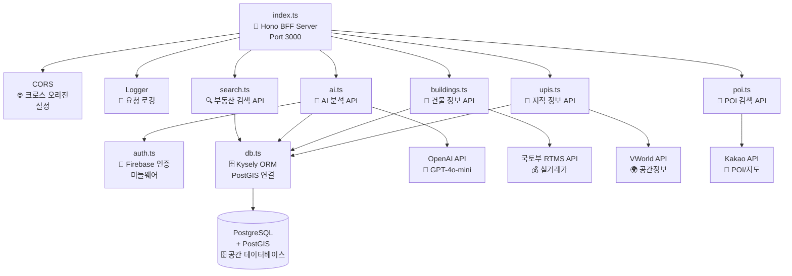

---

## 3. 주요 기능별 시퀀스 다이어그램

### 3.1 사용자 온보딩 프로세스

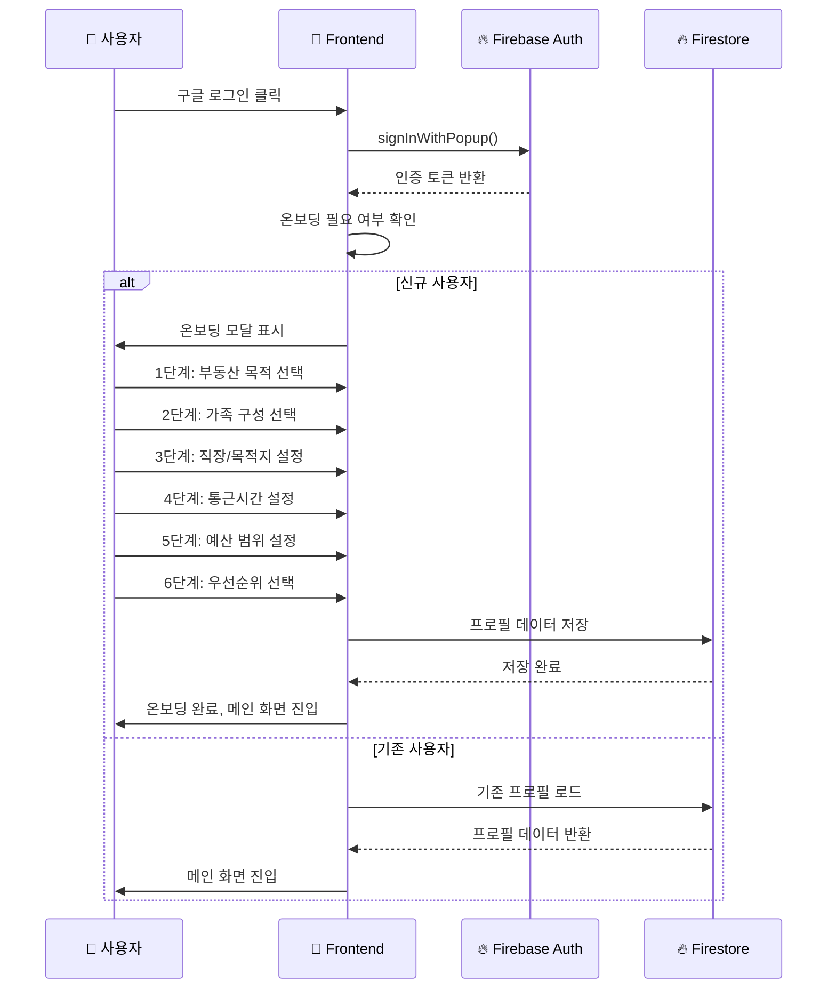

### 3.2 부동산 검색 및 정보 조회

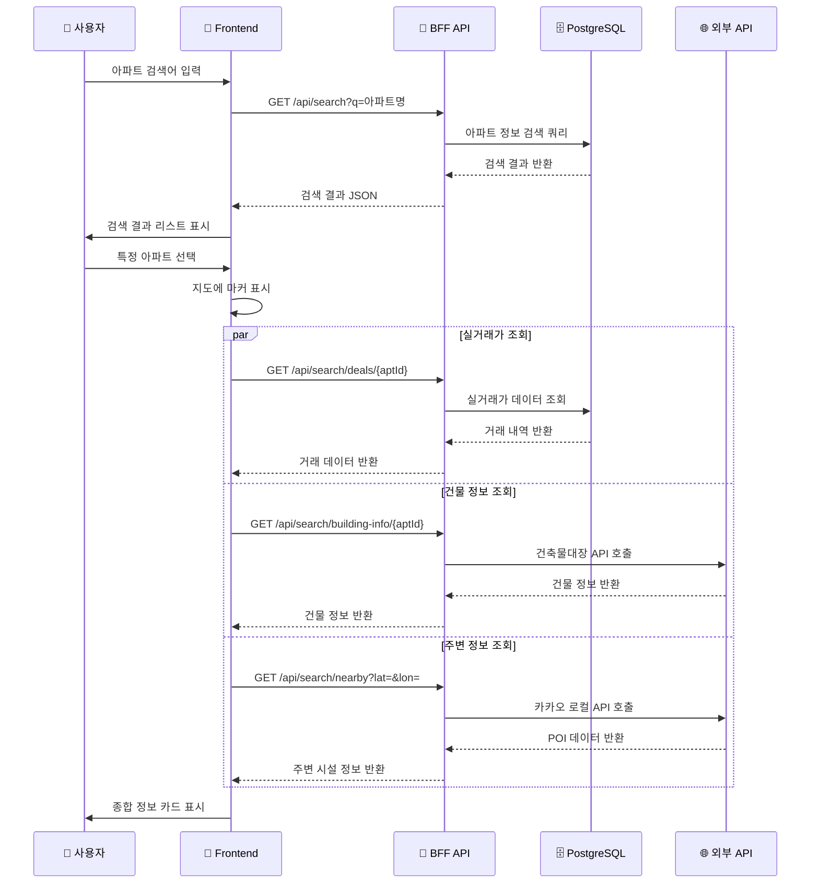

### 3.3 AI 종합 분석 프로세스

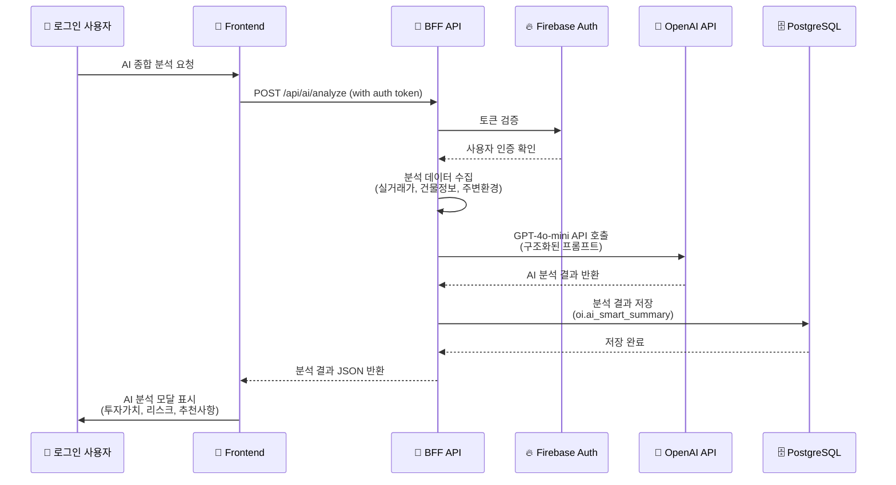

### 3.4 임장 메모 작성 및 관리

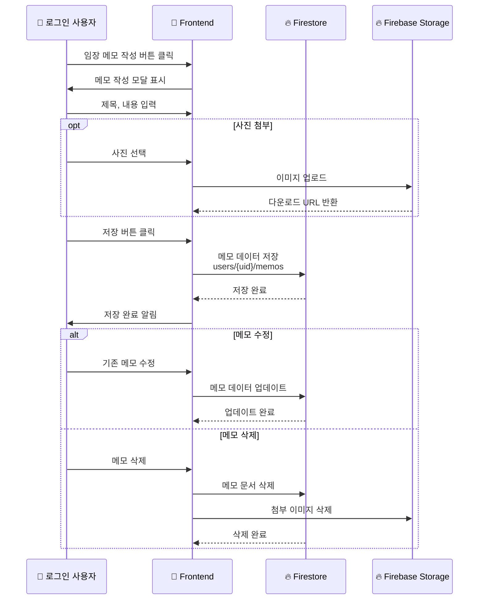

---

## 4. 데이터 플로우 다이어그램

### 전체 시스템 데이터 흐름

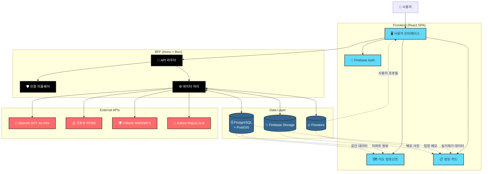

### 실시간 데이터 동기화

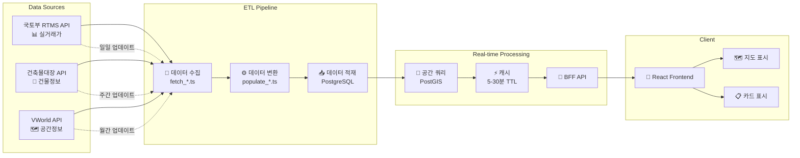

---

## 5. 데이터베이스 ER 다이어그램

### PostgreSQL + PostGIS 스키마

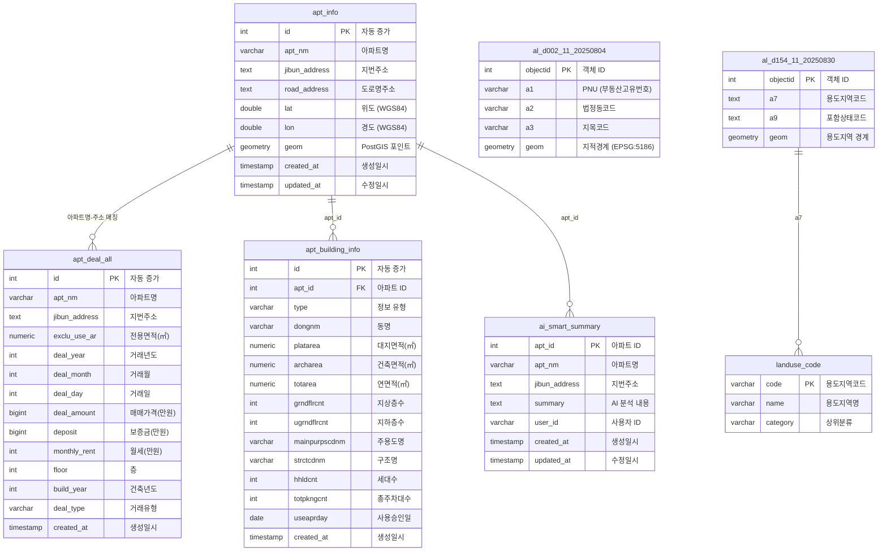

### Firebase Firestore 컬렉션 구조

```mermaid
flowchart TD
    %% Firestore 루트
    Root[(🔥 Firestore Root)]
    
    %% 사용자 컬렉션
    Users[👥 users/{uid}]
    Root --> Users
    
    %% 사용자 하위 컬렉션
    Profile[👤 profile/basic<br/>온보딩 설정]
    Favorites[⭐ favorites/{aptId}<br/>즐겨찾기]
    Memos[📝 memos/{memoId}<br/>임장 메모]
    
    Users --> Profile
    Users --> Favorites  
    Users --> Memos
    
    %% 프로필 데이터 구조
    Profile --> P1[purpose: 부동산 목적]
    Profile --> P2[familyType: 가족 구성]
    Profile --> P3[workLocation: 직장/목적지]
    Profile --> P4[commutingRadius: 통근시간]
    Profile --> P5[budgetRange: 예산 범위]
    Profile --> P6[priorities: 우선순위]
    Profile --> P7[completedAt: 완료일시]
    
    %% 즐겨찾기 데이터 구조
    Favorites --> F1[aptId: 아파트 ID]
    Favorites --> F2[aptName: 아파트명]
    Favorites --> F3[aptAddress: 주소]
    Favorites --> F4[lat/lon: 좌표]
    Favorites --> F5[createdAt: 생성일시]
    
    %% 메모 데이터 구조
    Memos --> M1[aptId: 아파트 ID]
    Memos --> M2[title: 제목]
    Memos --> M3[body: 내용]
    Memos --> M4[photoUrl: 사진 URL]
    Memos --> M5[createdAt: 생성일시]
    Memos --> M6[updatedAt: 수정일시]
```

---

## 📋 기능별 상세 워크플로우 요약

### 🔍 부동산 검색 플로우
1. **검색 입력** → 2. **API 호출** → 3. **DB 검색** → 4. **결과 표시** → 5. **지도 마커 표시**

### 🗺️ 지도 상호작용 플로우  
1. **지도 로드** → 2. **마커 표시** → 3. **오버레이 토글** → 4. **2D/3D 전환** → 5. **POI 표시**

### 🤖 AI 분석 플로우
1. **로그인 확인** → 2. **데이터 수집** → 3. **AI API 호출** → 4. **결과 저장** → 5. **모달 표시**

### 📝 임장 메모 플로우
1. **메모 작성** → 2. **사진 업로드** → 3. **Firestore 저장** → 4. **목록 업데이트**

### ⭐ 즐겨찾기 플로우
1. **즐겨찾기 추가** → 2. **확인 팝업** → 3. **Firestore 저장** → 4. **지도 핀 표시**

---

## 🏗️ 기술 스택 의존성 다이어그램

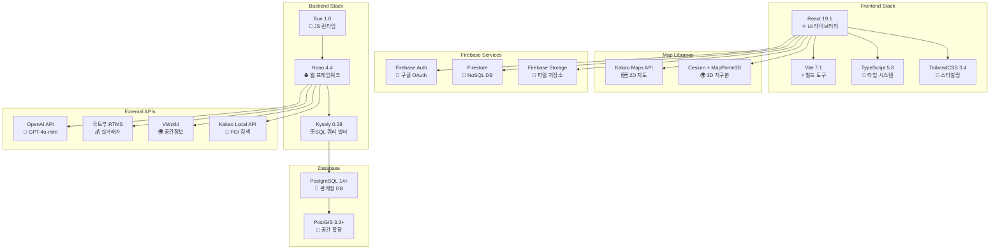

---

이 문서는 OpenImjang 시스템의 전체 아키텍처와 기능 흐름을 시각적으로 보여줍니다. 각 다이어그램은 시스템의 다른 관점에서 구조와 동작을 설명하며, GitHub에서 Mermaid 문법을 통해 자동으로 렌더링됩니다.